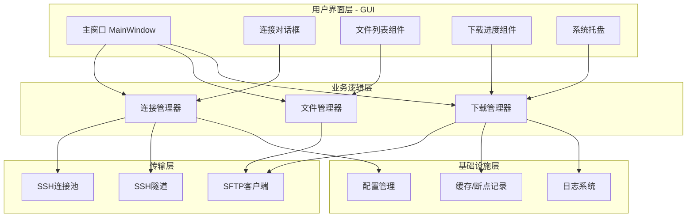
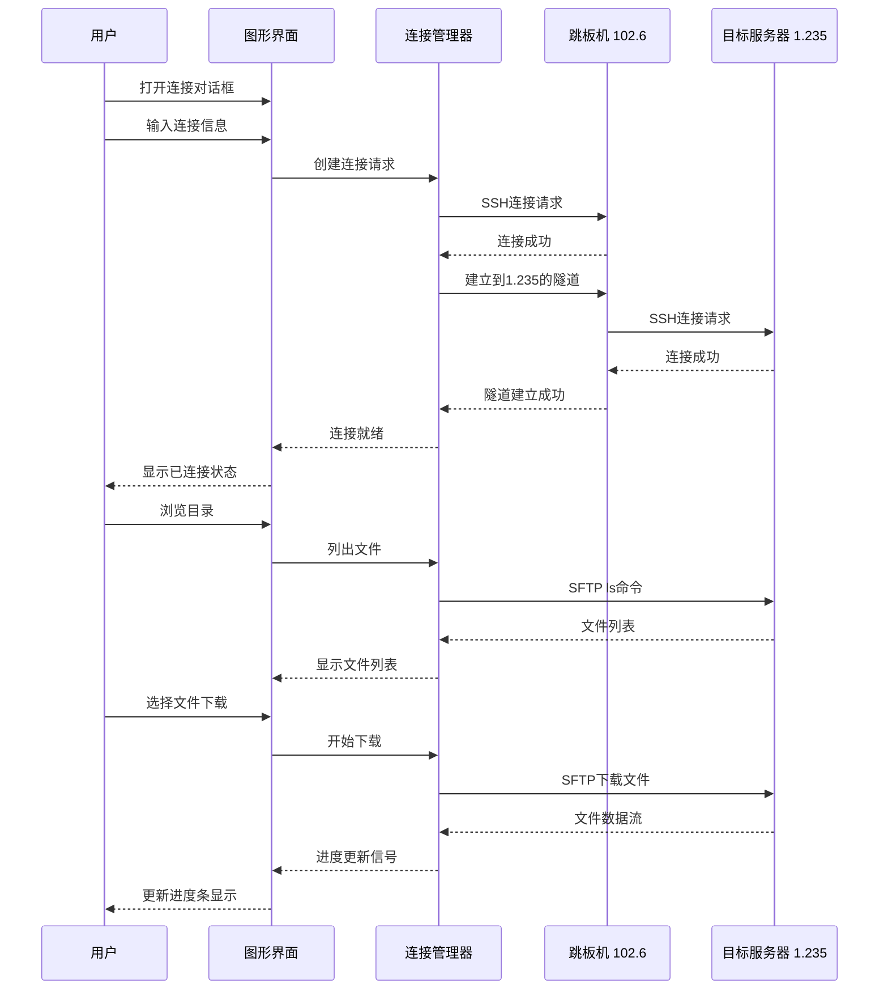
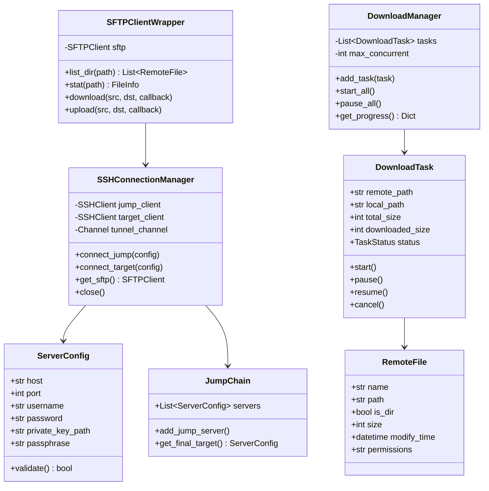
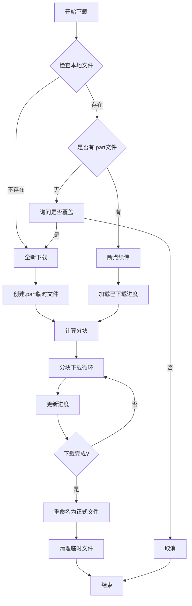
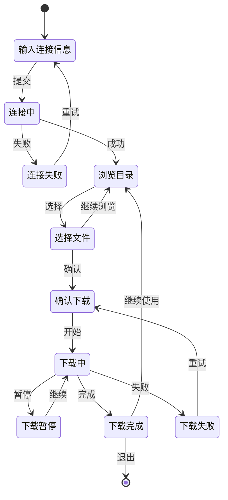
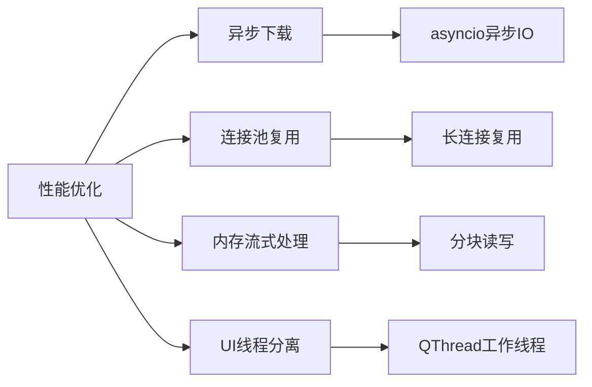
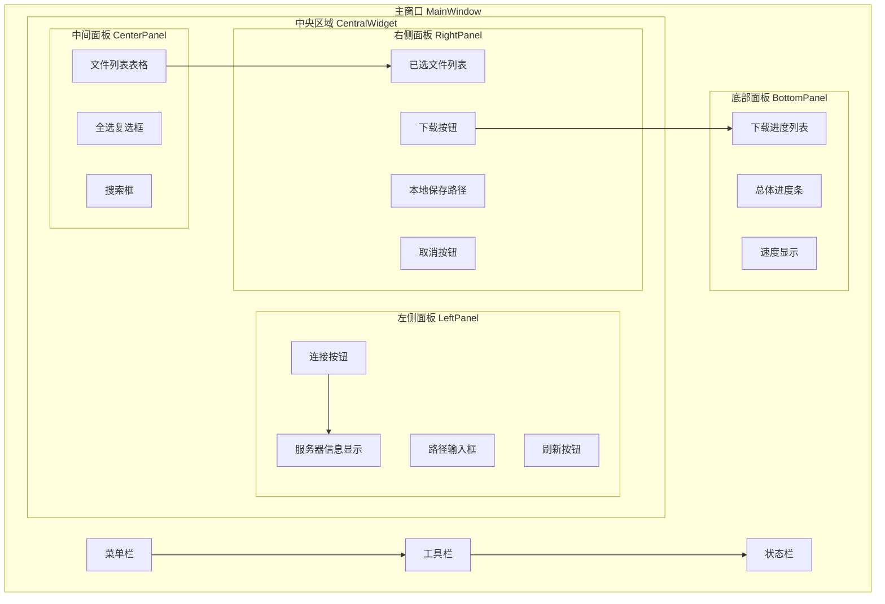
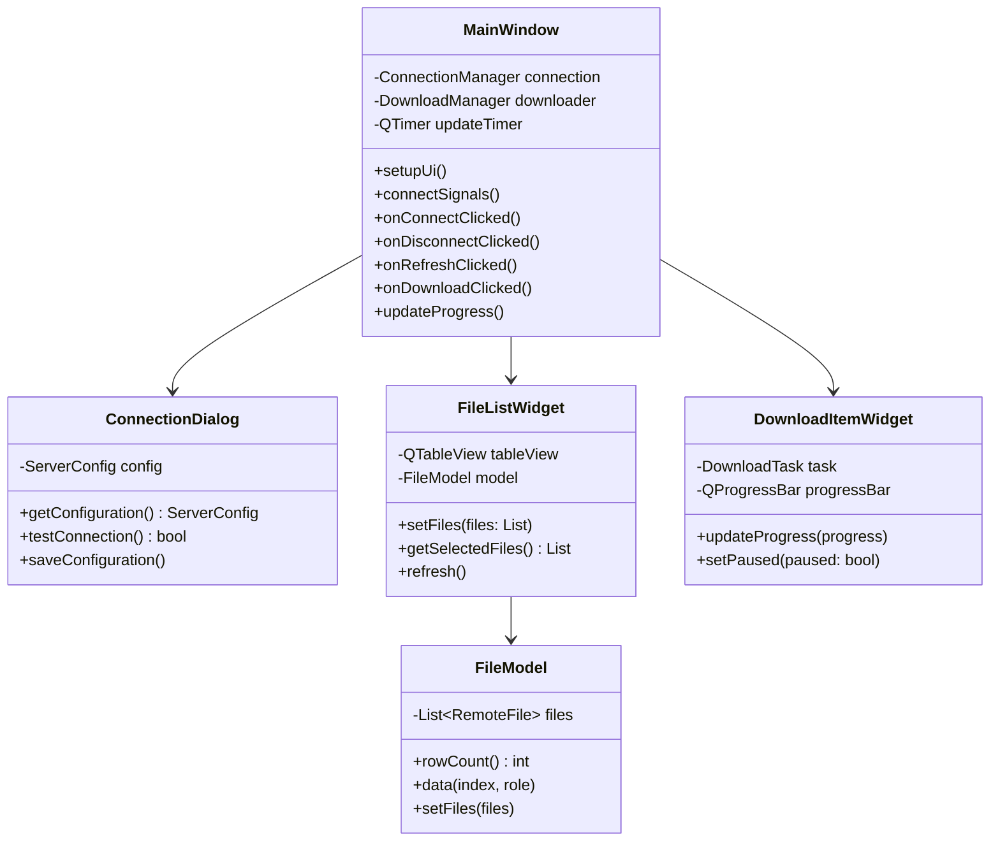
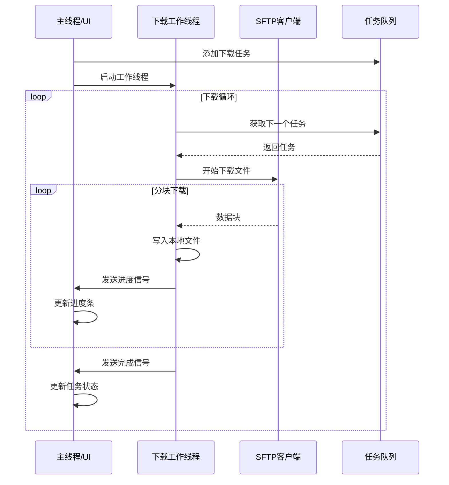

# SSH跳板机文件下载器 - 技术设计文档

## 1. 项目概述

### 1.1 项目背景
在企业环境中，敏感服务器通常部署在内网，需要通过跳板机（Bastion Host）才能访问。本项目旨在开发一个**高性能、低资源消耗**的图形界面文件下载工具，支持通过跳板机连接目标服务器，浏览目录并选择性下载文件。

### 1.2 核心功能
- SSH跳板机连接（支持多级跳板）
- 远程目录浏览和文件选择
- 大文件分块下载（支持GB级文件）
- 下载进度显示
- 断点续传
- 多文件批量下载
- **高性能图形用户界面（GUI）**

---

## 2. 系统架构

### 2.1 整体架构图



### 2.2 SSH连接流程



---

## 3. 模块详细设计

### 3.1 模块结构图

```
JumpFileDownload/
├── main.py                 # 程序入口
├── config.py               # 配置管理
├── requirements.txt        # 依赖清单
├── README.md               # 使用说明
│
├── core/                   # 核心模块
│   ├── __init__.py
│   ├── connection.py       # SSH连接管理
│   ├── tunnel.py           # SSH隧道管理
│   ├── sftp_client.py      # SFTP操作封装
│   └── downloader.py       # 文件下载器
│
├── ui/                     # 图形界面
│   ├── __init__.py
│   ├── main_window.py      # 主窗口
│   ├── dialogs/
│   │   ├── __init__.py
│   │   ├── connection_dialog.py  # 连接配置对话框
│   │   ├── settings_dialog.py    # 设置对话框
│   │   └── about_dialog.py       # 关于对话框
│   ├── widgets/
│   │   ├── __init__.py
│   │   ├── file_list_widget.py    # 文件列表组件
│   │   ├── download_item.py       # 下载项组件
│   │   ├── progress_widget.py    # 进度条组件
│   │   └── server_info_widget.py  # 服务器信息组件
│   └── resources/
│       ├── icons/                # 图标资源
│       └── styles/               # 样式表
│
├── utils/                  # 工具模块
│   ├── __init__.py
│   ├── logger.py           # 日志工具
│   ├── cache.py            # 缓存管理
│   └── file_utils.py       # 文件工具
│
└── models/                 # 数据模型
    ├── __init__.py
    ├── server.py           # 服务器配置模型
    └── download_task.py    # 下载任务模型
```

### 3.2 核心类设计

#### 3.2.1 类图



#### 3.2.2 核心类详细设计

**ServerConfig - 服务器配置类**

```python
@dataclass
class ServerConfig:
    """服务器连接配置"""
    host: str                    # 主机地址
    port: int = 22               # SSH端口
    username: str = None         # 用户名
    password: str = None         # 密码（可选）
    private_key_path: str = None # 私钥路径（可选）
    passphrase: str = None       # 私钥密码（可选）
    
    def validate(self) -> bool:
        """验证配置有效性"""
        pass
```

**SSHConnectionManager - SSH连接管理器**

```python
class SSHConnectionManager:
    """SSH连接管理器，支持跳板机连接"""
    
    def __init__(self):
        self._jump_clients: List[SSHClient] = []
        self._target_client: SSHClient = None
        self._sftp: SFTPClient = None
    
    def connect(self, jump_chain: JumpChain) -> bool:
        """
        建立SSH连接链
        
        Args:
            jump_chain: 跳板机链配置
        Returns:
            连接是否成功
        """
        pass
    
    def get_sftp(self) -> SFTPClient:
        """获取SFTP客户端"""
        pass
    
    def execute_command(self, command: str) -> Tuple[int, str, str]:
        """在目标服务器执行命令"""
        pass
    
    def close(self):
        """关闭所有连接"""
        pass
```

**DownloadManager - 下载管理器**

```python
class DownloadManager:
    """文件下载管理器"""
    
    def __init__(self, sftp: SFTPClient, max_concurrent: int = 3):
        self._sftp = sftp
        self._max_concurrent = max_concurrent
        self._tasks: Dict[str, DownloadTask] = {}
        self._progress_callbacks: List[Callable] = []
    
    def create_task(self, remote_path: str, local_path: str) -> DownloadTask:
        """创建下载任务"""
        pass
    
    def start_download(self, task_id: str):
        """开始下载任务"""
        pass
    
    def pause_download(self, task_id: str):
        """暂停下载"""
        pass
    
    def resume_download(self, task_id: str):
        """恢复下载（断点续传）"""
        pass
    
    def get_progress(self, task_id: str) -> DownloadProgress:
        """获取下载进度"""
        pass
```

---

## 4. 大文件下载策略

### 4.1 下载流程



### 4.2 分块下载策略

| 文件大小 | 分块大小 | 并发数 |
|---------|---------|-------|
| < 100MB | 不分块 | 1 |
| 100MB - 1GB | 10MB | 2 |
| 1GB - 10GB | 50MB | 3 |
| > 10GB | 100MB | 3 |

### 4.3 断点续传实现

```python
class ResumeInfo:
    """断点续传信息"""
    remote_path: str          # 远程文件路径
    local_path: str           # 本地保存路径
    file_size: int            # 文件总大小
    downloaded: int           # 已下载大小
    last_modified: float      # 远程文件最后修改时间
    checksum: str             # 文件校验和（可选）
    
    def save(self, path: str):
        """保存续传信息到文件"""
        pass
    
    @classmethod
    def load(cls, path: str) -> 'ResumeInfo':
        """从文件加载续传信息"""
        pass
```

---

## 5. 用户界面设计

### 5.1 主界面布局

```
┌─────────────────────────────────────────────────────────────────────────────┐
│ 文件(F)  编辑(E)  设置(S)  帮助(H)                           [_][□][×]    │
├─────────────────────────────────────────────────────────────────────────────┤
│ [连接] [断开] [刷新] [设置] [关于]                                          │
├─────────────────────────────────────────────────────────────────────────────┤
│ ┌─────────────────┐ ┌─────────────────────────────────────────────────────┐ │
│ │ 连接信息        │ │ 远程目录: [/home/user/data          ] [浏览] [刷新] │ │
│ │ ─────────────── │ ├─────────────────────────────────────────────────────┤ │
│ │ 跳板机:         │ │ [🔍 搜索...]                                       │ │
│ │ 102.6.7.8:22    │ ├──────┬──────┬────────┬────────────┬─────────────────┤ │
│ │ user@jump       │ │ [☑]  │ 类型 │ 大小   │ 修改时间   │ 文件名          │ │
│ │                 │ ├──────┼──────┼────────┼────────────┼─────────────────┤ │
│ │ 目标服务器:     │ │ [☐]  │ 📁   │ -      │ 2024-01-15 │ folder1         │ │
│ │ 192.168.1.235   │ │ [☐]  │ 📁   │ -      │ 2024-01-14 │ folder2         │ │
│ │ user@target     │ │ [☑]  │ 📄   │ 1.2 GB │ 2024-01-15 │ large_file.tar  │ │
│ │                 │ │ [☑]  │ 📄   │ 256 MB │ 2024-01-14 │ medium_file.zip │ │
│ │ 状态: ● 已连接  │ │ [☐]  │ 📄   │ 15 KB  │ 2024-01-13 │ small_file.txt  │ │
│ └─────────────────┘ └──────┴──────┴────────┴────────────┴─────────────────┘ │
│ ┌─────────────────────────────────────────────────────────────────────────┐ │
│ │ 已选文件 (2项, 共 1.45 GB)                          [清空] [下载选中]  │ │
│ │ ─────────────────────────────────────────────────────────────────────── │ │
│ │ 📄 large_file.tar.gz          1.2 GB    [移除]                         │ │
│ │ 📄 medium_file.zip            256 MB    [移除]                         │ │
│ │ ─────────────────────────────────────────────────────────────────────── │ │
│ │ 保存到: [./downloads                    ] [浏览...]                    │ │
│ └─────────────────────────────────────────────────────────────────────────┘ │
├─────────────────────────────────────────────────────────────────────────────┤
│ 下载进度                                                                    │
│ ┌─────────────────────────────────────────────────────────────────────────┐│
│ │ large_file.tar.gz                                                       ││
│ │ ████████████████████░░░░░░░░░░░░░░░░░░░░░░░░░░░░░░░░░░░░░░░░░░░  45%   ││
│ │ 540 MB / 1.2 GB    速度: 15.2 MB/s    剩余: 45秒    [暂停] [取消]      ││
│ ├─────────────────────────────────────────────────────────────────────────┤│
│ │ medium_file.zip                                                         ││
│ │ ████████████████████████████████████████████████████████████████  100%  ││
│ │ 256 MB / 256 MB    完成                                    [打开]      ││
│ └─────────────────────────────────────────────────────────────────────────┘│
│ 总进度: ████████████████████░░░░░░░░░░░░░░░░░░░░░░░░░░░░░░░░░░░░░  55%    │
├─────────────────────────────────────────────────────────────────────────────┤
│ 状态: 正在下载...  |  总速度: 15.2 MB/s  |  已完成: 1/2  |  队列: 0        │
└─────────────────────────────────────────────────────────────────────────────┘
```

### 5.2 连接配置对话框

```
┌─────────────────────────────────────────────────────────┐
│                    新建连接配置                          │
├─────────────────────────────────────────────────────────┤
│                                                         │
│  配置名称: [我的服务器配置                    ]          │
│                                                         │
│  ════════════════ 跳板机设置 ════════════════           │
│                                                         │
│  主机地址: [102.6.7.8          ]  端口: [22   ]         │
│  用户名:   [jump_user          ]                         │
│                                                         │
│  认证方式: ○ 密码  ● SSH密钥                            │
│           ┌─────────────────────────────────┐           │
│  密钥文件:│ ~/.ssh/id_rsa            [浏览] │           │
│           └─────────────────────────────────┘           │
│  密钥密码: [                          ] (可选)          │
│                                                         │
│  ════════════════ 目标服务器设置 ════════════════       │
│                                                         │
│  主机地址: [192.168.1.235       ]  端口: [22   ]        │
│  用户名:   [target_user         ]                        │
│                                                         │
│  认证方式: ● 密码  ○ SSH密钥                            │
│  密    码: [                          ]                  │
│                                                         │
│  [ ] 保存密码 (不推荐)                                  │
│                                                         │
│                         [测试连接]  [取消]  [保存]      │
└─────────────────────────────────────────────────────────┘
```

### 5.3 交互流程



---

## 6. 技术选型

### 6.1 核心依赖

| 库名 | 版本 | 用途 | 性能特点 |
|-----|------|-----|---------|
| paramiko | >=3.0 | SSH/SFTP连接 | 成熟稳定 |
| PyQt6 | >=6.4 | GUI框架 | 高性能、原生渲染 |
| asyncssh | >=2.14 | 异步SSH（可选） | 高并发性能 |

### 6.2 GUI框架选型对比

| 框架 | 内存占用 | 启动速度 | 渲染性能 | 推荐度 |
|-----|---------|---------|---------|-------|
| **PyQt6** | 中等 (~50MB) | 快 | 高（原生） | ⭐⭐⭐⭐⭐ |
| PySide6 | 中等 (~50MB) | 快 | 高（原生） | ⭐⭐⭐⭐ |
| tkinter | 低 (~20MB) | 最快 | 中等 | ⭐⭐⭐ |
| CustomTkinter | 低 (~25MB) | 快 | 中等 | ⭐⭐⭐⭐ |
| Dear PyGui | 高 (~80MB) | 中 | 最高（GPU） | ⭐⭐⭐ |

**推荐方案**: **PyQt6** - 性能与资源消耗的最佳平衡

### 6.3 性能优化策略



### 6.4 Python版本要求

- **最低版本**: Python 3.8+
- **推荐版本**: Python 3.10+（更好的异步支持）

---

## 7. 配置管理

### 7.1 配置文件格式 (YAML)

```yaml
# config.yaml
servers:
  jump:
    host: "102.6.7.8"
    port: 22
    username: "jump_user"
    # 密码或密钥二选一
    password: null
    private_key: "~/.ssh/id_rsa"
    
  target:
    host: "192.168.1.235"
    port: 22
    username: "target_user"
    password: null
    private_key: "~/.ssh/id_rsa"

download:
  local_dir: "./downloads"
  max_concurrent: 3
  chunk_size: "50MB"
  resume_enabled: true
  
logging:
  level: "INFO"
  file: "download.log"
```

### 7.2 环境变量支持

```bash
# 支持的环境变量
JUMP_HOST=102.6.7.8
JUMP_USER=jump_user
JUMP_PASSWORD=xxx

TARGET_HOST=192.168.1.235
TARGET_USER=target_user
TARGET_PASSWORD=xxx
```

---

## 8. 错误处理

### 8.1 异常类型

```python
class DownloadError(Exception):
    """下载错误基类"""
    pass

class ConnectionError(DownloadError):
    """连接错误"""
    pass

class AuthenticationError(ConnectionError):
    """认证失败"""
    pass

class TunnelError(ConnectionError):
    """隧道建立失败"""
    pass

class TransferError(DownloadError):
    """传输错误"""
    pass

class ChecksumError(TransferError):
    """校验失败"""
    pass

class DiskSpaceError(DownloadError):
    """磁盘空间不足"""
    pass
```

### 8.2 重试策略

| 错误类型 | 重试次数 | 重试间隔 | 处理方式 |
|---------|---------|---------|---------|
| 网络超时 | 3 | 5s | 自动重试 |
| 连接断开 | 5 | 10s | 自动重连 |
| 认证失败 | 0 | - | 提示用户 |
| 磁盘空间不足 | 0 | - | 提示用户 |

---

## 9. 安全考虑

### 9.1 密码安全
- 密码不保存在配置文件中（使用环境变量或运行时输入）
- 支持SSH密钥认证（推荐）
- 内存中的密码使用后立即清除

### 9.2 连接安全
- 验证服务器指纹（首次连接提示用户确认）
- 支持禁用known_hosts检查（开发环境）
- SSH连接超时设置

---

## 10. 扩展功能（可选）

### 10.1 多级跳板
支持多级跳板机，如：本地 → 跳板机A → 跳板机B → 目标服务器

### 10.2 文件校验
下载完成后验证文件MD5/SHA256校验和

### 10.3 带宽限制
限制下载速度，避免影响其他业务

### 10.4 定时下载
支持定时任务，在指定时间自动下载

---

## 11. 项目里程碑

### Phase 1: 核心功能
- [ ] SSH连接管理（单跳板机）
- [ ] SFTP文件浏览
- [ ] 基本文件下载
- [ ] 断点续传

### Phase 2: GUI框架
- [ ] 主窗口框架搭建
- [ ] 连接配置对话框
- [ ] 文件列表组件
- [ ] 下载进度组件
- [ ] 多线程下载处理

### Phase 3: 性能优化
- [ ] 异步下载实现
- [ ] 连接池复用
- [ ] 内存流式处理
- [ ] 分块并行下载

### Phase 4: 高级功能
- [ ] 多级跳板机支持
- [ ] 文件校验
- [ ] 带宽限制
- [ ] 系统托盘
- [ ] 打包发布

---

## 12. GUI图形界面设计

### 12.1 技术选型

| 框架 | 内存占用 | 启动速度 | 渲染性能 | 推荐度 |
|-----|---------|---------|---------|-------|
| **PyQt6** | 中等 (~50MB) | 快 | 高（原生渲染） | ⭐⭐⭐⭐⭐ |
| PySide6 | 中等 (~50MB) | 快 | 高（原生渲染） | ⭐⭐⭐⭐ |
| CustomTkinter | 低 (~25MB) | 快 | 中等 | ⭐⭐⭐⭐ |
| tkinter | 低 (~20MB) | 最快 | 中等 | ⭐⭐⭐ |

**推荐方案**: **PyQt6** - 性能与资源消耗的最佳平衡

### 12.2 GUI架构设计



### 12.3 界面原型设计

#### 12.3.1 主界面布局

```
┌─────────────────────────────────────────────────────────────────────────────┐
│ 文件(F)  编辑(E)  设置(S)  帮助(H)                           [_][□][×]    │
├─────────────────────────────────────────────────────────────────────────────┤
│ [连接] [断开] [刷新] [设置] [关于]                                          │
├─────────────────────────────────────────────────────────────────────────────┤
│ ┌─────────────────┐ ┌─────────────────────────────────────────────────────┐ │
│ │ 连接信息        │ │ 远程目录: [/home/user/data          ] [浏览] [刷新] │ │
│ │ ─────────────── │ ├─────────────────────────────────────────────────────┤ │
│ │ 跳板机:         │ │ [🔍 搜索...]                                       │ │
│ │ 102.6.7.8:22    │ ├──────┬──────┬────────┬────────────┬─────────────────┤ │
│ │ user@jump       │ │ [☑]  │ 类型 │ 大小   │ 修改时间   │ 文件名          │ │
│ │                 │ ├──────┼──────┼────────┼────────────┼─────────────────┤ │
│ │ 目标服务器:     │ │ [☐]  │ 📁   │ -      │ 2024-01-15 │ folder1         │ │
│ │ 192.168.1.235   │ │ [☐]  │ 📁   │ -      │ 2024-01-14 │ folder2         │ │
│ │ user@target     │ │ [☑]  │ 📄   │ 1.2 GB │ 2024-01-15 │ large_file.tar  │ │
│ │                 │ │ [☑]  │ 📄   │ 256 MB │ 2024-01-14 │ medium_file.zip │ │
│ │ 状态: ● 已连接  │ │ [☐]  │ 📄   │ 15 KB  │ 2024-01-13 │ small_file.txt  │ │
│ └─────────────────┘ └──────┴──────┴────────┴────────────┴─────────────────┘ │
│ ┌─────────────────────────────────────────────────────────────────────────┐ │
│ │ 已选文件 (2项, 共 1.45 GB)                          [清空] [下载选中]  │ │
│ │ ─────────────────────────────────────────────────────────────────────── │ │
│ │ 📄 large_file.tar.gz          1.2 GB    [移除]                         │ │
│ │ 📄 medium_file.zip            256 MB    [移除]                         │ │
│ │ ─────────────────────────────────────────────────────────────────────── │ │
│ │ 保存到: [./downloads                    ] [浏览...]                    │ │
│ └─────────────────────────────────────────────────────────────────────────┘ │
├─────────────────────────────────────────────────────────────────────────────┤
│ 下载进度                                                                    │
│ ┌─────────────────────────────────────────────────────────────────────────┐│
│ │ large_file.tar.gz                                                       ││
│ │ ████████████████████░░░░░░░░░░░░░░░░░░░░░░░░░░░░░░░░░░░░░░░░░░░  45%   ││
│ │ 540 MB / 1.2 GB    速度: 15.2 MB/s    剩余: 45秒    [暂停] [取消]      ││
│ ├─────────────────────────────────────────────────────────────────────────┤│
│ │ medium_file.zip                                                         ││
│ │ ████████████████████████████████████████████████████████████████  100%  ││
│ │ 256 MB / 256 MB    完成                                    [打开]      ││
│ └─────────────────────────────────────────────────────────────────────────┘│
│ 总进度: ████████████████████░░░░░░░░░░░░░░░░░░░░░░░░░░░░░░░░░░░░░  55%    │
├─────────────────────────────────────────────────────────────────────────────┤
│ 状态: 正在下载...  |  总速度: 15.2 MB/s  |  已完成: 1/2  |  队列: 0        │
└─────────────────────────────────────────────────────────────────────────────┘
```

#### 12.3.2 连接配置对话框

```
┌─────────────────────────────────────────────────────────┐
│                    新建连接配置                          │
├─────────────────────────────────────────────────────────┤
│                                                         │
│  配置名称: [我的服务器配置                    ]          │
│                                                         │
│  ════════════════ 跳板机设置 ════════════════           │
│                                                         │
│  主机地址: [102.6.7.8          ]  端口: [22   ]         │
│  用户名:   [jump_user          ]                         │
│                                                         │
│  认证方式: ○ 密码  ● SSH密钥                            │
│           ┌─────────────────────────────────┐           │
│  密钥文件:│ ~/.ssh/id_rsa            [浏览] │           │
│           └─────────────────────────────────┘           │
│  密钥密码: [                          ] (可选)          │
│                                                         │
│  ════════════════ 目标服务器设置 ════════════════       │
│                                                         │
│  主机地址: [192.168.1.235       ]  端口: [22   ]        │
│  用户名:   [target_user         ]                        │
│                                                         │
│  认证方式: ● 密码  ○ SSH密钥                            │
│  密    码: [                          ]                  │
│                                                         │
│  [ ] 保存密码 (不推荐)                                  │
│                                                         │
│                         [测试连接]  [取消]  [保存]      │
└─────────────────────────────────────────────────────────┘
```

### 12.4 GUI模块结构

```
ui/
├── __init__.py
├── main_window.py          # 主窗口
├── dialogs/
│   ├── __init__.py
│   ├── connection_dialog.py    # 连接配置对话框
│   ├── settings_dialog.py      # 设置对话框
│   └── about_dialog.py         # 关于对话框
├── widgets/
│   ├── __init__.py
│   ├── file_list_widget.py     # 文件列表组件
│   ├── download_item_widget.py # 下载项组件
│   ├── progress_widget.py      # 进度条组件
│   └── server_info_widget.py   # 服务器信息组件
├── models/
│   ├── __init__.py
│   ├── file_model.py           # 文件数据模型
│   └── download_model.py       # 下载数据模型
└── resources/
    ├── icons/                  # 图标资源
    ├── styles/                 # 样式表
    │   └── style.qss
    └── translations/           # 国际化
```

### 12.5 核心GUI类设计



### 12.6 关键GUI代码示例

**主窗口类 (PyQt6)**

```python
from PyQt6.QtWidgets import (
    QMainWindow, QWidget, QVBoxLayout, QHBoxLayout,
    QPushButton, QLabel, QTableView, QProgressBar
)
from PyQt6.QtCore import Qt, QTimer

class MainWindow(QMainWindow):
    def __init__(self):
        super().__init__()
        self.setWindowTitle("SSH跳板机文件下载器")
        self.setGeometry(100, 100, 1200, 800)
        
        # 核心组件
        self.connection_manager = None
        self.download_manager = None
        
        # 设置UI
        self.setup_ui()
        self.connect_signals()
        
        # 进度更新定时器
        self.update_timer = QTimer()
        self.update_timer.timeout.connect(self.update_progress)
        self.update_timer.start(500)  # 每500ms更新一次
    
    def setup_ui(self):
        """构建界面"""
        # 创建中央部件
        central_widget = QWidget()
        self.setCentralWidget(central_widget)
        
        # 主布局
        main_layout = QHBoxLayout(central_widget)
        
        # 左侧面板 - 连接信息
        left_panel = self.create_left_panel()
        main_layout.addWidget(left_panel)
        
        # 中间面板 - 文件列表
        center_panel = self.create_center_panel()
        main_layout.addWidget(center_panel, stretch=2)
        
        # 右侧面板 - 已选文件
        right_panel = self.create_right_panel()
        main_layout.addWidget(right_panel)
        
        # 底部面板 - 下载进度
        bottom_panel = self.create_bottom_panel()
        self.addDockWidget(Qt.DockWidgetArea.BottomDockWidgetArea, bottom_panel)
    
    def on_connect_clicked(self):
        """连接按钮点击"""
        dialog = ConnectionDialog(self)
        if dialog.exec():
            config = dialog.get_configuration()
            self.connect_to_server(config)
    
    def on_download_clicked(self):
        """下载按钮点击"""
        selected_files = self.file_list.get_selected_files()
        local_path = self.local_path_input.text()
        
        for file in selected_files:
            self.download_manager.add_task(file.path, local_path)
```

**文件列表组件**

```python
from PyQt6.QtWidgets import QTableView, QHeaderView
from PyQt6.QtCore import QAbstractTableModel, Qt

class FileModel(QAbstractTableModel):
    """文件列表数据模型"""
    
    HEADERS = ["选择", "类型", "大小", "修改时间", "文件名"]
    
    def __init__(self, files=None):
        super().__init__()
        self.files = files or []
        self.checked = set()
    
    def rowCount(self, parent=None):
        return len(self.files)
    
    def columnCount(self, parent=None):
        return len(self.HEADERS)
    
    def data(self, index, role):
        if not index.isValid():
            return None
            
        file = self.files[index.row()]
        col = index.column()
        
        if role == Qt.ItemDataRole.DisplayRole:
            if col == 1:
                return "📁" if file.is_dir else "📄"
            elif col == 2:
                return self.format_size(file.size)
            elif col == 3:
                return file.modify_time.strftime("%Y-%m-%d %H:%M")
            elif col == 4:
                return file.name
        
        elif role == Qt.ItemDataRole.CheckStateRole and col == 0:
            return Qt.CheckState.Checked if index.row() in self.checked else Qt.CheckState.Unchecked
        
        return None
    
    def setData(self, index, value, role):
        if role == Qt.ItemDataRole.CheckStateRole and index.column() == 0:
            if value == Qt.CheckState.Checked.value:
                self.checked.add(index.row())
            else:
                self.checked.discard(index.row())
            self.dataChanged.emit(index, index)
            return True
        return False
```

### 12.7 多线程下载处理



**下载工作线程**

```python
from PyQt6.QtCore import QThread, pyqtSignal

class DownloadWorker(QThread):
    """后台下载工作线程"""
    
    progress_updated = pyqtSignal(str, int, int)  # task_id, downloaded, total
    download_completed = pyqtSignal(str, str)      # task_id, local_path
    download_error = pyqtSignal(str, str)          # task_id, error_message
    
    def __init__(self, sftp_client, task_queue):
        super().__init__()
        self.sftp = sftp_client
        self.task_queue = task_queue
        self.running = True
    
    def run(self):
        """线程主循环"""
        while self.running:
            task = self.task_queue.get()
            if task is None:
                break
            
            try:
                self.download_file(task)
            except Exception as e:
                self.download_error.emit(task.id, str(e))
    
    def download_file(self, task):
        """下载单个文件"""
        callback = lambda downloaded, total: \
            self.progress_updated.emit(task.id, downloaded, total)
        
        self.sftp.download(
            task.remote_path,
            task.local_path,
            callback=callback
        )
        
        self.download_completed.emit(task.id, task.local_path)
```

### 12.8 GUI依赖

| 库名 | 版本 | 用途 |
|-----|------|-----|
| PyQt6 | >=6.4 | GUI框架（推荐） |
| CustomTkinter | >=5.2 | 现代化tkinter（备选） |
| qt-material | >=2.14 | Material Design样式 |

### 12.9 打包发布

使用 `PyInstaller` 打包为可执行文件：

```bash
# 打包命令
pyinstaller --name "SSHDownloader" \
            --windowed \
            --onefile \
            --icon=resources/icon.ico \
            --add-data "resources:resources" \
            main.py
```

---

## 13. 总结

本设计文档描述了一个基于Python的SSH跳板机文件下载器的完整技术方案。核心使用`paramiko`库实现SSH连接和SFTP文件传输，支持通过跳板机访问内网服务器，并提供图形界面文件选择、大文件分块下载、断点续传等功能。

**关键特性**：
1. 支持SSH跳板机连接（ProxyJump）
2. 高性能图形用户界面（PyQt6）
3. 大文件分块并行下载
4. 断点续传支持
5. 实时进度显示
6. 完善的错误处理和重试机制
7. **低资源消耗、高性能设计**
